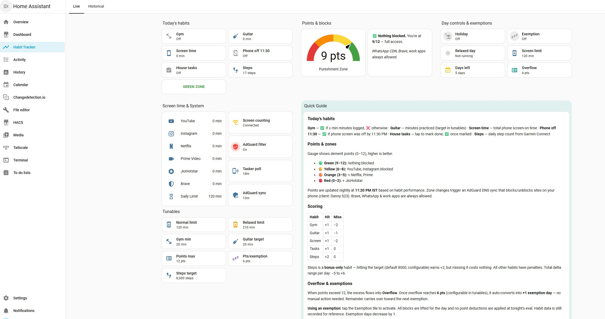
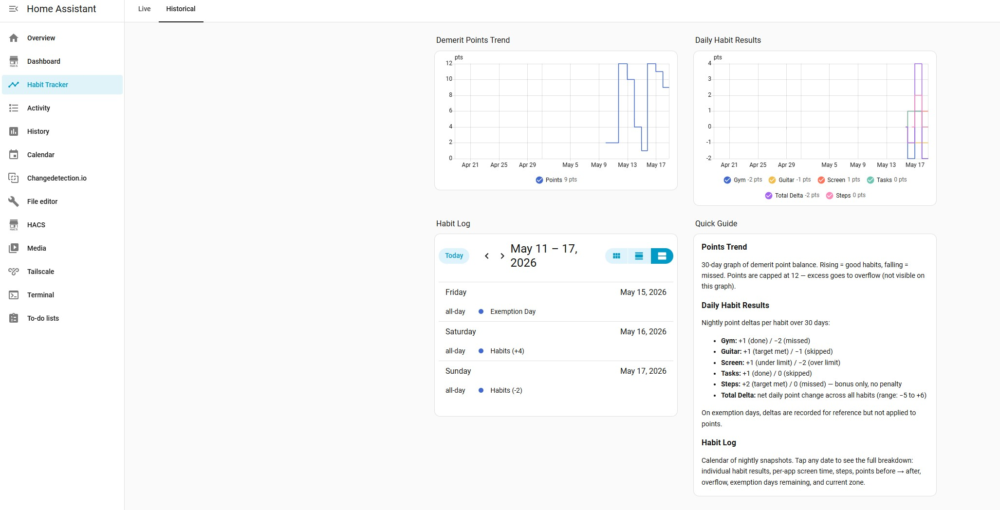

# Watchtower — Personal Assistant System

**Three AI agents merging with Home Automation ensuring daily habits are enforceable with Dynamic rules based app blocks.**

A production system where AI agents track daily habits, automate a smart home, and manage household tasks — running 24/7 on a home server in India.

> **[Setup Guide](SETUP.md)** · **[Architecture](ARCHITECTURE.md)** · **[Tasker Profiles (TaskerNet)](https://taskernet.com/shares/?user=AS35m8m2eEjbtUOEvTGebDnO%2BFqCohIxCwGpphAqCnUF7DX7GnW96cp8iXIT05ZOmbPNauUrz2uTq%2FA%3D&id=Project%3AApps+Usage+To+HA)**





---

## What This Is

This is the complete, working configuration of a multi-agent AI system I built and use every day. This has been running in production since early 2026. The system:

- **Tracks five daily habits** and enforces consequences by blocking streaming sites at the DNS level when I fall behind
- **Automates the home** — lights respond to context, power cuts are detected and handled gracefully, a robot vacuum responds to NFC taps
- **Manages household tasks** for the family through a shared Telegram group

Everything is controlled through Telegram. I message the agents like I'd message a person, and they respond, take actions, and keep me accountable.

## For the Unfamiliar

This project sits at the intersection of several tools. Here's what each one does:

| Tool | Role in This System |
|------|---------------------|
| **[Home Assistant](https://www.home-assistant.io/)** | Open-source home automation platform running on a mini PC. Controls smart lights, sensors, and devices. The "brain" of the smart home. |
| **[OpenClaw](https://github.com/nicholasgriffintn/OpenClaw)** | Multi-agent orchestration platform. Routes Telegram messages to the right AI agent, manages agent workspaces, provides tool access (web search, HA control, file management). |
| **[Tasker](https://tasker.joaoapps.com/)** | Android automation app. Here, it reports phone screen time and per-app usage to Home Assistant every 90 seconds via webhooks. |
| **[AdGuard Home](https://adguard.com/en/adguard-home/overview.html)** | DNS-level content filter. Normally used for ad blocking, but here it selectively blocks streaming and social media based on habit performance. |
| **Telegram** | The unified interface. All three agents communicate through Telegram bots. |

---

## The Agents

### Kal-El — Personal Assistant

**Model:** Claude Opus (Anthropic) — or any frontier-tier LLM

The generalist. Handles research, planning, creative work, and coding assistance. Has access to web search (Brave, Tavily), Home Assistant controls, Gmail and Calendar (via CLI tools), and can coordinate with Jarvis and Jo when needed. Kal-El should be the most capable model in your stack — it handles complex reasoning, multi-step tasks, and creative work.

### Jarvis — Habit Tracker & Life Ops

**Model:** Claude Sonnet (Anthropic) — or any strong mid-tier LLM

The accountability engine. Jarvis runs frequently and needs to be reliable, but doesn't require frontier-level reasoning. The sweet spot between capability and token cost. Monitors five daily habits, maintains a demerit point system with real enforcement, and runs six capability modules:

| Module | What It Does |
|--------|-------------|
| Home Pulse | On-demand Home Assistant status and anomaly detection |
| Thought Catcher | Daily Google Tasks triage — fixes garbled voice-dictated titles, sorts into lists |
| Inbox Intel | Gmail reading, action item flagging, time-sensitive thread alerts |
| Smart Reminders | Context-aware reminders (not just time-based) |
| Subscription Sentinel | Tracks renewals, flags price changes, spots unused services |
| Daily Brief | Morning summary combining all active modules |

### Jo — House Tasks Manager

**Model:** Nemotron (via Ollama cloud, free tier)

A lightweight model is all Jo needs. House task management is a narrow, well-defined domain - Daily & future tasks reminder setup & tasks notifications. The Ollama free tier handles this comfortably, keeping costs at zero for a high-frequency use case. Any decent lightweight model works here.

---

## The Jarvis Habit System

This is the core of the project — a gamified self-improvement system with real-world enforcement that I can't easily bypass.

### Five Tracked Habits

| Habit | How It's Tracked | Target | Points |
|-------|-----------------|--------|--------|
| Gym | GPS zone detection via Home Assistant | 20+ min visit | +1 done · -2 missed |
| Learning Guitar | App usage reported by Tasker | 20+ min practice | +1 done · -1 missed |
| Screen Time | Tasker reports every 90s via webhook | Under daily limit | +1 under · -2 over |
| Daily Steps | Garmin Connect integration | 8,000+ steps | +2 done · 0 missed |
| House Tasks | Telegram button confirmation | Confirm by 11 PM | +1 done · 0 missed |

**Late phone use** (screen active after 11:30 PM): additional -1 penalty.

The screen time limit adjusts automatically: **120 minutes** on normal days, **210 minutes** on weekends and holidays.

### Demerit Points & Enforcement Zones

Points range from 0 to 12, evaluated nightly at 11:20 PM IST. Your point total determines your **zone**, which controls what content is accessible on your phone:

| Zone | Points | What Gets Blocked |
|------|--------|-------------------|
| Green | 9–12 | Nothing |
| Yellow | 6–8 | YouTube, Instagram |
| Orange | 3–5 | + Netflix, Prime Video |
| Red | 0–2 | + Hotstar, Disney+ |

**How enforcement works:** AdGuard Home runs as the DNS resolver for the phone (you point your device's DNS settings to AdGuard's IP). When the zone changes, Home Assistant pushes updated per-client filtering rules to AdGuard's API. The blocks apply at the DNS level — every app on the phone is affected, not just the browser. You can't bypass it by switching apps or using a different browser.

### Overflow & Exemption Days

Sustained good behavior is rewarded. When points would exceed 12, the excess accumulates as **overflow**. Every 6 overflow points convert into 1 **exemption day** — a token you can declare at any time to skip that night's evaluation.

On an exemption day:
- No point changes at the nightly eval
- All DNS blocks lifted for the day
- Late phone use check paused
- Habits are still tracked and logged, just with no consequences

This creates a positive feedback loop: consistently hitting habits builds a buffer for guilt-free days off.

### The Daily Cycle

```
Throughout the day:
  Tasker       → reports app usage every ~90s via webhook
  HA zones     → detect gym entry/exit via GPS
  Garmin       → syncs step count
  AdGuard      → re-synced every 15 min (drift correction)

22:30          House tasks prompt (Telegram inline buttons)
23:20          Nightly evaluation — compute deltas, apply points, send report
23:30          Late phone check
23:35          Late phone demerit (-1 if flagged)
00:00          Midnight reset — clear daily trackers, carry over points
```

All times are IST (UTC+5:30).

---

## Home Assistant Integration

### Power Cut Management

Frequent power outages in India required a dedicated detection and recovery system:

- **Detection:** A secondary router (on a different circuit with no UPS) is pinged every 3 seconds. When it goes offline, a power cut is flagged.
- **Light suppression:** WiZ smart bulbs default to ON when power returns. The system catches each bulb powering on during instability and immediately turns it back off — preventing the whole house from lighting up during rapid cycling.
- **State preservation:** Light states (brightness, color temperature) are saved to a persistent helper whenever they change. After power stabilizes for 30 seconds, the saved state is restored across all 7 watched lights.
- **Logging & reporting:** Each event is logged with timestamp, duration, and blip count. A weekly Telegram report summarizes power stability.

### Smart Lighting

- Study lights turn on automatically at sunset or during rain, but only when the Study room PC is active
- Phone battery warning: study lights turn red when the phone drops below 50% after 8 PM — a visual nudge to charge so that i don't go to sleep with a nearly dead phone. They restore to normal when charging begins.
- Living room lights auto-off at bedtime when the PC shuts down or goes to sleep

### NFC Vacuum Control

Three NFC tags (one per room) toggle the robot vacuum — tap to start cleaning that room, tap again to pause. A physical interface for a smart device.

### Screen Time Pipeline

The screen time tracking pipeline is the connective tissue between the phone and the habit system:

1. **Tasker** polls app usage stats on the phone every ~90 seconds
2. Posts a JSON payload to a Home Assistant webhook with per-app minutes
3. HA updates `input_number` helpers for each tracked app (YouTube, Instagram, Netflix, Prime, Hotstar, Brave, Guitar)
4. A template sensor sums all screen-time apps into a total
5. Template triggers fire progressive warnings at 50%, 75%, 92%, and 100% of the daily limit
6. At the nightly eval, the total is compared against the limit for scoring

---

## Multi-Agent Architecture

### Routing

All three agents share Telegram as their interface, each with a distinct scope:

- **Private messages** to the bot route to Kal-El, with Jarvis handling habit-specific commands
- **Group messages** in the house tasks chat route to Jo
- **Inline button callbacks** (like "Tasks Done") route directly to the corresponding Home Assistant script

### Workspace Isolation

Each agent has its own workspace directory containing persona files, tool configuration, and behavioral rules. This means each agent has a different personality, different knowledge base, and different tool access — despite running on the same platform.

### Coordination

- Jarvis reads Home Assistant state directly via MCP (Model Context Protocol) tools
- Jo manages task files that Jarvis references during nightly evaluation
- Kal-El can invoke either agent's capabilities when needed
- All three send messages via Telegram but maintain separate conversation contexts

---

## Getting Started

Want to build something similar? See **[SETUP.md](SETUP.md)** for the complete step-by-step replication guide, covering everything from server setup to end-to-end testing. See **[ARCHITECTURE.md](ARCHITECTURE.md)** for file structure, design decisions, and developer documentation.

At a high level, you'll need:
- **An always-on server** (mini PC with UPS recommended) — runs HA, AdGuard, and OpenClaw. If it goes down, the entire system stops.
- **An Android phone** with Tasker for screen time tracking
- **AdGuard Home** — should run on a separate VM from HA so it stays up during HA restarts. DNS filtering must be always available.
- **LLM API access** — a frontier model for Kal-El for updating/fixing code, a capable mid-tier for Jarvis, and any lightweight model for Jo (Anthropic, OpenAI, Ollama — your choice)
- **A Telegram account** and bots created via @BotFather

Tasker profiles are available for direct import from TaskerNet:
- [Apps Usage To HA](https://taskernet.com/shares/?user=AS35m8m2eEjbtUOEvTGebDnO%2BFqCohIxCwGpphAqCnUF7DX7GnW96cp8iXIT05ZOmbPNauUrz2uTq%2FA%3D&id=Project%3AApps+Usage+To+HA)
- [Late Phone Usage Alert To HA](https://taskernet.com/shares/?user=AS35m8m2eEjbtUOEvTGebDnO%2BFqCohIxCwGpphAqCnUF7DX7GnW96cp8iXIT05ZOmbPNauUrz2uTq%2FA%3D&id=Project%3ALate+phone+Usage+alert+To+HA)

The repo includes `.env.example` with all required environment variables, HA configs you can adapt, and a pre-commit hook that auto-scrubs secrets on commit.

## Security

All credentials are externalized — nothing sensitive is committed:

- API keys and bot tokens live in `.env` (gitignored), referenced via `${VAR}` in config
- HA passwords and auth headers live in `secrets.yaml` (gitignored), referenced via `!secret` in YAML
- Webhook IDs are auto-scrubbed to placeholders by the pre-commit hook on every commit
- A `.secret-patterns` safety net catches any credential patterns that slip through

## License

MIT
